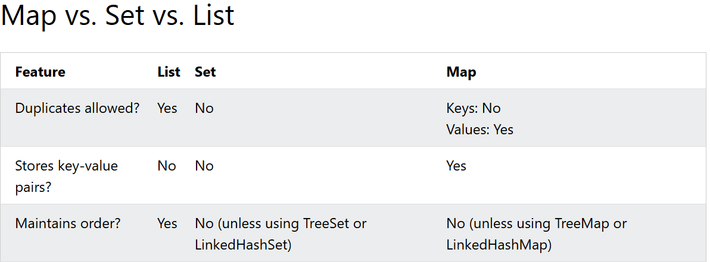

JAVA LIST INTERFACE

- List memperhatikan urutan

beberapa method yang dapat digunakan:
add() : menambahkan elemen di bagian paling akhir
get() : mengembalikan elemen pada posisi tertentu
set() : mengganti elemen berdasarkan posisi tertentu
remove() : menghapus elemen dari sebuah posisi tertentu
size() : mengembalikan ukuran elemen pada list

Array():
1. ukuran tetap
2. lebih cepat untuk data mentah
3. tidak merupakan bagian dari collection framework

List():
1. ukuran yang dinamis
2. lebih flexible dan kaya fitur
3. merupakan bagian dari collection framework

ArrayList
- array yang ukurannya dapat dirubah
ArrayList<String> cars = new ArrayList<>();

ArrayList akan mempertahankan apa yang kita insert atau masukkan

VAR keyword dapat juga digunakan untuk mendeklarasikan sebuah ArrayList tanpa menuliskan dua kali misalnya

-- Sebelum menggunakan var
ArrayList<String> cars = new ArrayList<String>();
-- Menggunakan var
var cars = new ArrayList<String>();

kita juga dapat melihat tipe kode dengan versi seperi berikut:
List<String> cars = new ArrayList<>();

Tipe variablenya merupakan List dan Object aslinya merupakan ArrayList

JAVA LinkedList
Setiap data yang disimpan dalam sebuah Node yang sering disebut sebagai container pada dokumentasi sederhana

Perbedaan antara ArrayList dan LinkedList
ArrayList lebih cepat dalam mengambil data, baca data dan mengakses berdasaarkan indeks
sedangkan untuk LinkedList lebih cepat dalam menambahkan, menghapus, dan sisipkan data karena 

Kapan Menggunakan
ArrayList digunakan untuk menyimpan dan mengakses data sedangkan LinkedList digunakan untuk memanipulasi data

Method yang digunakan
addFirst() : menambahkan elemen pertama pada list
addLast() : menambahkan elemen pada akhir list
removeFirst() : menghapus elemen pada elemn pertama list
removeLast() : menghapus elemen pada elemen terakhir list
getFirst() : mendapatkan elemen pertama list
getLast() : mendapatkan elemen terakhir list

LinkedList<String> cars = new LinkedList<String>();
bisa juga menggunakan keyword var

-- Dapat juga menggunakan List untuk tipe data dan object yaitu LinkedList()

JAVA SORTING LIST
Kita dapat melakukan sorting menggunakan method sort dengan mengimport class Collections dengan sintaks
Collections.sort(object)

JAVA SET
Set merupakan bagian dari Java Collections Framework yang digunakan untuk menyimpan data unik (tidak duplikat) dan tidak mempertahankan urutan elemen

- HashSet => cepat tetapi tidak berurut
- TreeSet => berurutan
- LinkedHashSet => berurutan berdasarkan penambahan

- method yang digunakan adalah sebagai berikut:
1. add() : untuk menambahkan elemen jika belum ada di dalam set
2. remove() : menghapus elemen
3. contains() : mengecek apakah set mengandung elemen tertentu
4. size() : untuk mencek ukuran set
5. clear() : untuk menghapus semua elemen

Perbedaan antara List dan juga Set
1. List
- dapat duplikat
- memperhatikan urutan
- dapat diakses menggunakan indeks

2. Set
- tidak dapat duplikat
- tidak menjamin urutan
- tidak melalui indeks untuk mengakses

JAVA HASH SET
merupakan kumpulan elemen yang isinya unik (tidak dapat duplikat)

keyword HashSet<String> cars = new HashSet<String>();
beberapa method yang dapat digunakan yaitu add(), contains(), remove()

kita juga dapat menggunakan keyword var 
BEFORE:
HashSet<String> cars = new HashSet<String>();
AFTER
var cars = new HashSet<String>();

Sama seperti List, List juga dapat dideklarasikan sebagai objek yang menampung HashSet

JAVA TREE SET
merupakan koleksi yang menampung nilai yang unik dan menghasilkan value dengan format terurut

Treeset<String> cars = new TreeSet<>();
beberapa method yang digunakan yaitu add() untuk menambahkan elemen, contains() untuk mengecek sebuah elemen ada atau tidak dalam sebuah koleksi, remove() untuk menghapus sebuah elemen, clear() untuk menghapus semua elemen, size() untuk mendapatkan ukuran dari sebuah koleksi, 

sama seperti HashSet, kita dapat menggunanakan deklarasi variable var, kemudian bisa menggunakan perulangan

JAVA LINKED HASH SET
LinkedHashSet -> menyimpan nilai yang unik dan mempertahankan urutan sesuai dengan yang kita insert

LinkedHashSet<String> cars = new LinkedHashSet<>();

untuk properti sama seperti List dan juga Set yang lain (HashSet, dan TreeSet)

perbedaan dengan HashSet
HashSet: Tidak berurut, tidak dapat duplikat, dan lebih cepat
LinkedHashSet : Urutan sesuai dengan bagaimana di insert, tidak dapat duplikat, dan lebih lambat dikarenakan urutan 

dapat juga menggunakan keyword var dan juga Set untuk deklarasi 

JAVA MAP
merupakan bagian dari Java Collection Framework yang digunakan untuk menyimpan pasangan key-value
setiap key harus unik, tetapi values dapat duplikat

Class yang biasa digunakan yaitu:
hashMap : cepat tetapi tidak berurut
TreeMap : diurutkan berdasarkan key
LinkedHashMap : diurutkan berdasarkan penambahan (add)

beberapa method yang sering digunakan:
put() : menambahkan atau edit pasangan key-value
get() : mengembalikan nilai dari sebuah key
remove() : menghapus sebuah key dan juga value
containsKey() : check apakah sebuah map memiliki key tertentu
keySet() : mengembalikan kumpulan dari key

JAVA HASH MAP
HashMap menyimpan pasangan key-value dimana setiap key memiliki nilai yang spesifik

HashMap dapat menyimpan berbagai kombinasi tipe data :
String keys and Integer Values
String keys and String values

Kita dapat menggunakan keyword var juga untuk HashMap
kemudian dapat juga menggunakan Map untuk variable

JAVA TREEMAP
- merupakan koleksi untuk menyimpan pasangan key/values yang diurutkan berdasarkan kunci

TreeMap<String, String> capitalCities = new TreeMap<>();

untuk property sama dengan yang ada di HashMap

PERBEDAAN antara HashMap dan TreeMap
TreeMap : diurutkan berdasarkan keys, tidak dapat berisi null keys, lebih lambat karena memperhatiakn urutan key
HashMap : Tidak ada urutan, mengizinkan memberikan nilai null untuk key, dan lebih cepat dikarenakan tidak ada sorting

bisa menggunaakn keyword var juga dan deklarasi menggunakan Map

JAVA LINKED HASH MAP
LinkedHasMap menyimpan pasangan key-value dan mempertahakan urutan sebagaimana awal diinsert

LinkedHashmap<String, String> capitalCities = new LinkedHashMap<>();

sama dengan Map yang lain bisa deklarasi menggunakan keyword var dan juga interface Map

JAVA ITERATOR
Iterate : Berjalan satu per satu 

Perbedaan Loop dengan Iterator 

Iterator dapat dengan mudah mengubah koleksi saat loop sedang berjalan sedangkan untuk loop tidak, karena loop hanya membaca 

bisa menggunakan keyword var untuk deklarasi

JAVA ALGORITHMS

Algoritma merupakan langkah-langkah dalam menyelesaikan sebuah masalah

Beberapa method yang sering digunakan yaitu:
Collections.max() menemukan value tertinggi
Collections.min() menemukan value terendah
Collections.shuffle() : mengacak random elemen
Collections.frequency() : menghitung berapa kali sebuah elemen muncul
Collections.swap() : menukar 2 elemen di dalam list

